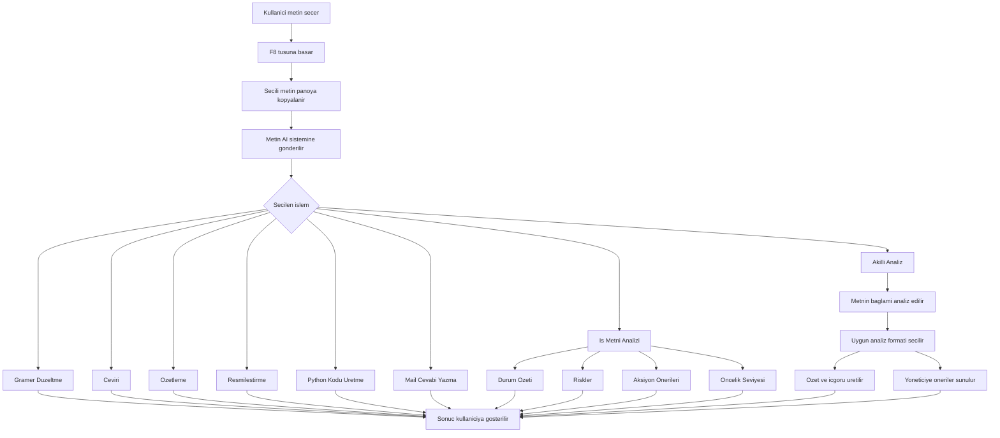

# 📊 AI Destekli Metin Analiz ve Karar Destek Sistemi

## 📌 Genel Bakış

Bu proje, kullanıcı tarafından seçilen metinleri analiz ederek anlamlı, bağlama uygun ve aksiyon odaklı çıktılar üreten bir **AI destekli metin analiz sistemidir**.

Sistem, arka planda çalışan bir masaüstü uygulaması olarak tasarlanmıştır. Kullanıcı herhangi bir uygulamada metin seçtikten sonra `F8` tuşuna basarak sisteme hızlı erişim sağlayabilir. Bu sayede uygulama, kullanıcı akışını bozmadan çalışır ve pratik bir kullanım sunar.

Proje geliştirilirken özellikle **kullanıcı deneyimi, hız ve otomasyon** ön planda tutulmuştur. Metin kopyalama işlemi otomatik olarak gerçekleştirilir, analiz süreci arka planda çalışır ve sonuçlar ayrı bir pencerede kullanıcıya sunulur.

Ayrıca sistem, yerel olarak çalışan AI modeli sayesinde internet bağlantısına bağımlı olmadan da çalışabilir. Bu yönüyle proje hem **offline çalışabilen** hem de gerektiğinde genişletilebilir bir yapı sunar.

---

## 🎯 Projenin Amacı

Bu projenin temel amacı, metin analiz sürecini manuel bir işlem olmaktan çıkarıp **otomatik ve akıllı bir sürece dönüştürmektir**.

Geleneksel yöntemde kullanıcı metni okuyup yorumlamak zorundadır. Bu proje ile birlikte:

- Metin otomatik olarak algılanır  
- İçeriği analiz edilir  
- Anlamlandırılır  
- Kullanıcıya doğrudan uygulanabilir öneriler sunulur  

Bu sayede kullanıcı yalnızca bilgi almakla kalmaz, aynı zamanda **karar verme sürecinde yönlendirilir**.

Proje, klasik araçlardan farklı olarak yalnızca çıktı üretmez; aynı zamanda **analiz eder, yorumlar ve önerir**.

---

## 🧠 Sistem Özellikleri

### 🔹 Metin Tabanlı Etkileşim (F8 Menü Sistemi)

Kullanıcı herhangi bir uygulamada metin seçtikten sonra `F8` tuşuna basarak sisteme erişebilir.

Sistem, seçilen metni otomatik olarak panoya kopyalar ve kullanıcıya bir işlem menüsü sunar.

Sunulan işlemler:

- Gramer düzeltme  
- Çeviri (TR / EN)  
- Özetleme  
- Resmileştirme  
- Python kodu üretimi  
- Mail cevabı oluşturma  
- İş metni analizi  
- Akıllı analiz (otomatik)  

Bu yapı sayesinde kullanıcı, farklı araçlara ihtiyaç duymadan tüm işlemleri tek bir sistem üzerinden gerçekleştirebilir.

---

### 🔹 Bağlam Analizi

Sistem, metni yalnızca yüzeysel olarak işlemez; metnin bağlamını analiz eder.

Bu analiz sürecinde:

- Metnin konusu belirlenir  
- Kullanıcının amacı tahmin edilir  
- En uygun işlem türü seçilir  

Bu sayede sistem, her metne aynı yaklaşımı uygulamak yerine **duruma özel analiz** yapar.

---

### 🔹 AI Destekli Metin Analizi

Sistem, yerel AI modeli (Ollama + gemma3:1b) kullanarak metin üzerinde derin analiz gerçekleştirir.

Üretilen çıktılar:

- Kısa ve net özet  
- Temel çıkarımlar  
- Risk değerlendirmesi  
- Aksiyon önerileri  

Bu sayede kullanıcı, uzun metinleri hızlı şekilde anlayabilir ve yorumlayabilir.

---

### 🔹 Karar Destek Sistemi

Proje, yalnızca analiz yapan bir araç değildir.

Aynı zamanda:

- Yönetici perspektifi sunar  
- Karar alma sürecini destekler  
- Alternatif çözüm önerileri üretir  

Bu yönüyle sistem, pasif bir araç yerine **aktif bir yardımcı sistem** olarak çalışır.

---

## ⚙️ Gereksinimler & Kurulum

Bu bölüm, projenin farklı sistemlerde sorunsuz şekilde çalıştırılabilmesi için gerekli olan yazılım bileşenlerini ve kurulum adımlarını açıklamaktadır.

### 🔧 Sistem Gereksinimleri

Projeyi çalıştırmak için aşağıdaki gereksinimler sağlanmalıdır:

- Python 3.10 veya üzeri  
- Ollama (yerel AI çalıştırma ortamı)  
- gemma3:1b modeli  
- Windows işletim sistemi (önerilir)  

---


### ⚙️ Kurulum Adımları

```bash
git clone https://github.com/HamzAltunkaynak/ai-text-analyzer.git
cd ai-text-analyzer

python -m venv .venv
.venv\Scripts\activate
pip install -r requirements.txt

ollama run gemma3:1b

python main.pyw
```

 ---

## 🧩 Sistem Mimarisi


