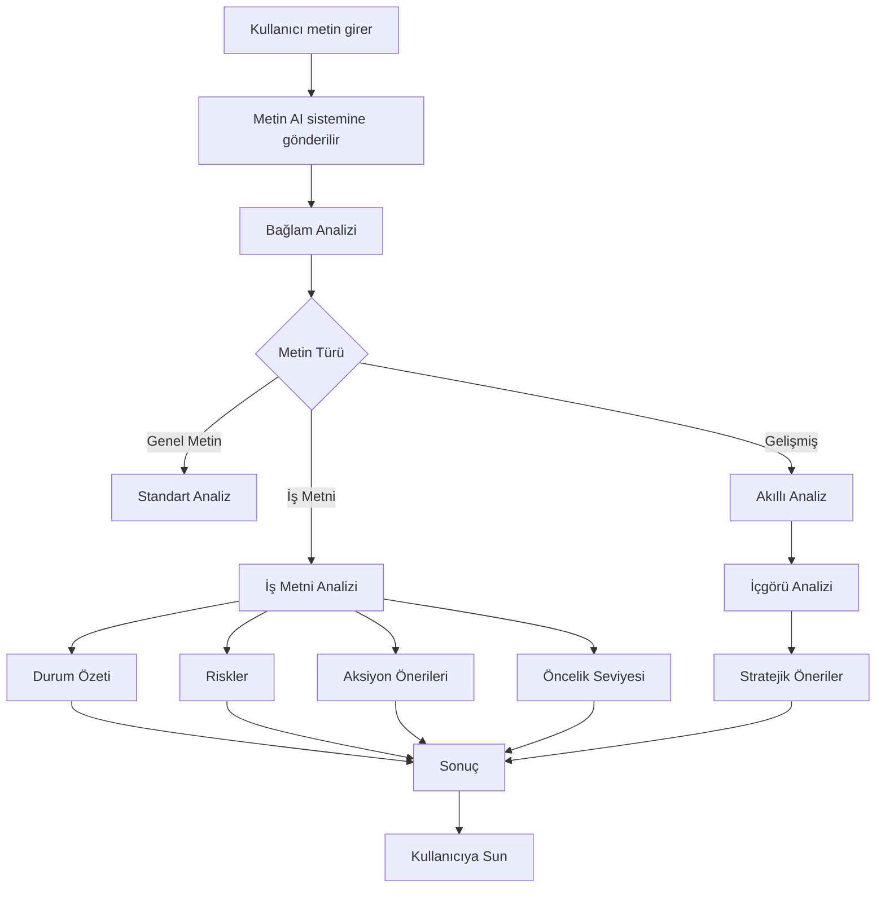

# 🚀 AI Destekli Metin Analiz ve Karar Destek Sistemi

Bu proje, kullanıcı tarafından girilen metinleri analiz ederek bağlama uygun, aksiyon odaklı ve yapılandırılmış çıktılar üreten bir **AI destekli metin analiz sistemidir**.

Amaç, özellikle iş dünyasında kullanılan metinleri hızlıca analiz ederek **karar alma süreçlerini hızlandırmak** ve kullanıcıya anlamlı içgörüler sunmaktır.

---

## 🎯 Projenin Amacı

- Metinleri sadece özetlemek değil, **anlamak ve yorumlamak**
- Kullanıcıya:
  - 📊 İçgörü
  - ⚠️ Risk analizi
  - 💡 Aksiyon önerisi
  sunmak
- AI destekli sistem ile **manuel analiz süresini minimuma indirmek**

---

## 💡 Ne İşe Yarar?

Bu sistem:

- İş metinlerini analiz eder
- Problemleri ve riskleri tespit eder
- Yönetici seviyesinde öneriler üretir
- Metni **karar destek çıktısına dönüştürür**

---

## ⚙️ Özellikler

### 🧠 İş Metni Analizi
- 📌 Durum Özeti  
- ⚠️ Risk Analizi  
- 💡 Aksiyon Önerileri  
- 🔥 Öncelik Belirleme  

### 🤖 Akıllı Analiz (Context-Aware AI)
- Metnin bağlamını analiz eder  
- En uygun analiz formatını otomatik seçer  
- Yöneticiye özel içgörüler üretir  

### 📊 Yapılandırılmış Çıktı Sistemi
- Başlıklandırılmış analiz  
- Okunabilir ve profesyonel çıktı  
- Sunuma hazır format  

---

## 🧠 Nasıl Çalışır?



---

## ⚙️ Gereksinimler & Kurulum
### 🧩 Gereksinimler
- Python 3.8+
- pip (Python paket yöneticisi)
- (Opsiyonel) Ollama / OpenAI API

### 📦 Kurulum

```bash
git clone https://github.com/HamzAltunkaynak/ai-text-analyzer.git
cd ai-text-analyzer
pip install -r requirements.txt
```

### 🤖 AI Model Kurulumu (Opsiyonel - Ollama)

```bash
ollama pull llama3.2
ollama serve
```

### ▶️ Çalıştırma

```bash
python main.py
```

---

## 📌 Örnek Kullanımlar ve Beklenen Çıktılar

### 🧠 1. İş Metni Analizi

### 📥 Girdi:

```bash
Proje teslim tarihi yaklaşıyor ancak ekipte gecikmeler yaşanıyor. 
Bazı görevler tamamlanmadı ve müşteri memnuniyeti riske girebilir. 
Ekip içinde iletişim eksikliği olduğu gözlemleniyor.
```

### 📤 Beklenen Çıktı:

#### 📌 Durum Özeti:
Proje teslim tarihi yaklaşırken ekipte gecikmeler yaşanmakta ve bu durum müşteri memnuniyetini riske sokmaktadır.

#### ⚠️ Riskler:

- Proje teslim tarihinin gecikmesi
- Ekip içi iletişim eksikliği
- Tamamlanmamış görevler
- Müşteri memnuniyetsizliği

#### 💡 Önerilen Aksiyonlar:

- Gecikme nedenleri analiz edilmeli
- Görevler önceliklendirilmelidir
- Ekip içi iletişim artırılmalıdır
- Müşteri ile şeffaf iletişim kurulmalıdır
- Gerekirse ek kaynak sağlanmalıdır

#### 🔥 Öncelik: Yüksek

---

### 🤖 2. Akıllı Analiz

### 📥 Girdi:

```bash
Son üç ayda satışlarda düşüş yaşandı. Reklam bütçesi azaltıldı ve müşteri geri dönüşleri azaldı. 
Rakip firmaların kampanyaları daha görünür hale geldi.
```

### 📤 Beklenen Çıktı:

#### 📊 Kısa Özet:
- Satışlarda düşüş yaşanmış, müşteri geri dönüşleri azalmış ve rekabet artmıştır.

#### 📈 Temel İçgörüler:

- Rekabetin artması satışları etkilemiştir
- Pazarlama stratejileri yetersiz kalmıştır
- Müşteri etkileşimi düşmüştür

#### 💡 Yöneticiye Öneri:

- Yeni pazarlama stratejileri geliştirilmeli
- Reklam bütçesi optimize edilmeli
- Müşteri deneyimi iyileştirilmelidir
- Rakip analizi yapılmalıdır

#### 📝 Ek Notlar:

- Satış verileri detaylı analiz edilmelidir
- A/B testleri uygulanmalıdır
- Kampanya stratejileri güncellenmelidir

---

## 📁 Proje Yapısı

```text
Introduction-to-Data-Visualization-Project-Assignment/
│
├── main.pyw            # Ana uygulama (GUI + tüm işlem mantığı)
├── README.md           # Proje dokümantasyonu
├── requirements.txt    # Gerekli Python kütüphaneleri
├── BASLAT.bat          # Windows için hızlı başlatma scripti
├── kurulum.bat         # Otomatik kurulum scripti
│
├── .venv/              # Sanal ortam (virtual environment)
├── __pycache__/        # Python cache dosyaları
│
└── .gitattributes      # Git ayarları
```

---

## 🚀 Sonuç

- Bu proje, klasik metin analiz araçlarından farklı olarak:

Sadece analiz yapmaz ❌
Karar destek sistemi gibi çalışır ✅

👉 Kullanıcıya aynı anda sunar:

- Ne olduğunu
- Neden olduğunu
- Ne yapılması gerektiğini

---

## 🎯 Kimler Kullanmalı?
- Proje yöneticileri
- İş analistleri
- Girişimciler
- Yazılımcılar
- Veri analistleri
